# Introduction

Questionnaire is a pwn challenge on hackthebox that is rated *very easy*. It gives an introduction to the basics of binaries and reading C. There is no exploitation per se, but it is beneficial for beginners nonetheless.
# Enumeration
In the included zip file, we find two files, `test` (a binary) and `test.c` (contains some C code).

using `file test`, we obtain the following Info:

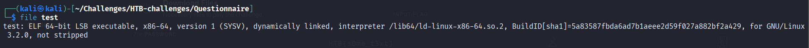

We find that it is a 64-bit binary and that it is dynamically linked. Not useful as of now, but may come useful later.

Running `checksec` on the binary, we get the following info:

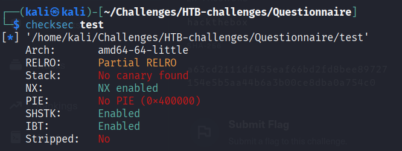


# Exploitation

First, we connect using `netcat`:
```shell
nc <host> <port>
```


## Part I - Binary Questions


When we first connect to it, we get a long list of definitions, after which we are asked multiple questions.

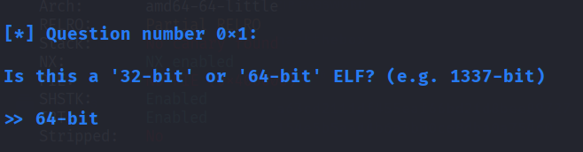


For question 1 and 2, we have gained this info from running the `file` command on the binary provided.

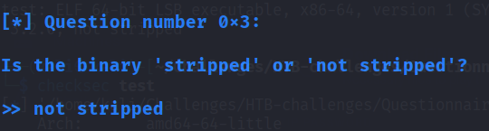

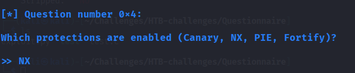

For question 3 and 4, we found this through running `checksec` prior.

## Part II - C Questions

The next part gives us some basic C code to analyze. It also provides some description and context. Below is a snippet of it:

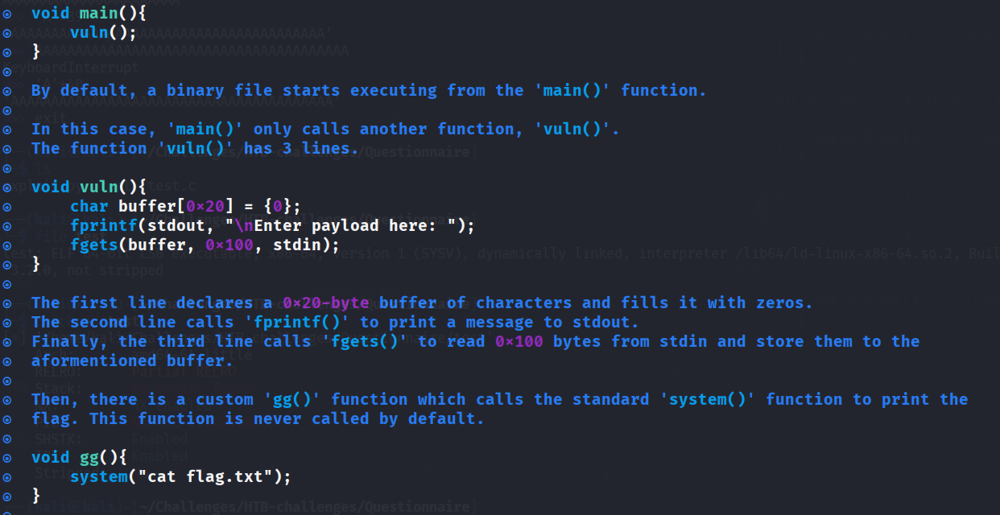

The next set of questions are all related to the C code given.

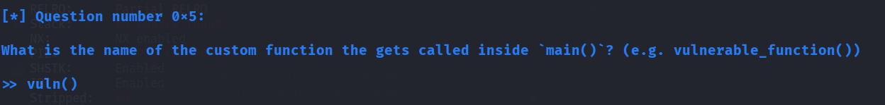

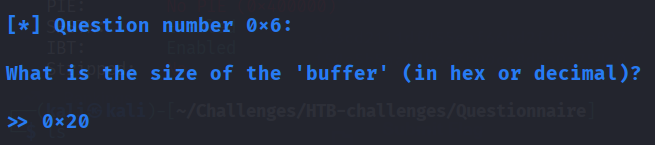

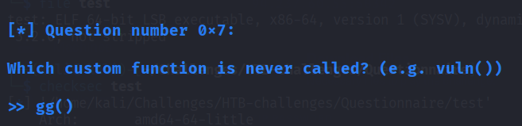

## Part III - Buffer Overflow Questions

This section started similarly to the others, with a bunch of definitions and explanations.
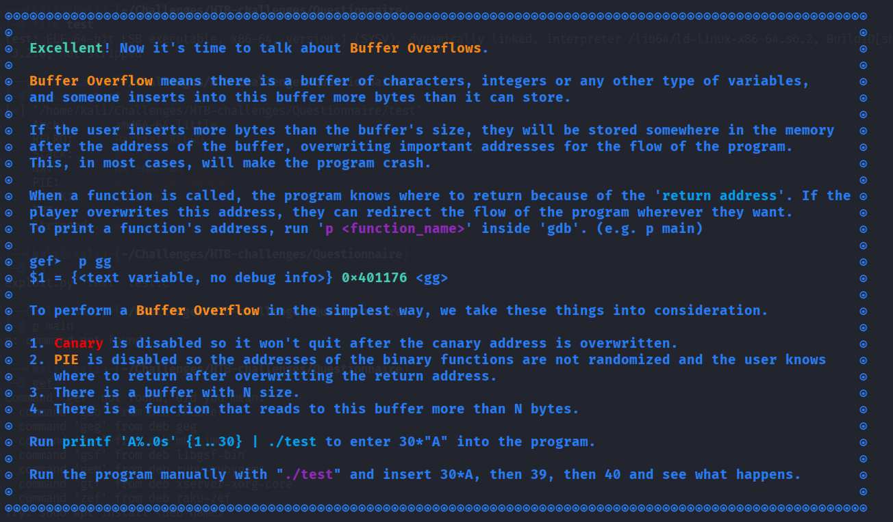

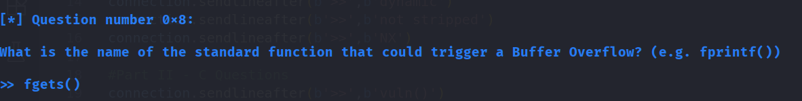


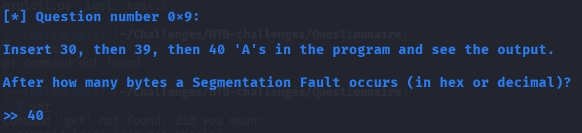 


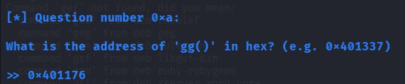

For this question, I used `Ghidra` and obtained the value through that instead of reading (arguably harder).

Once the tenth question is solved, we get the flag back.

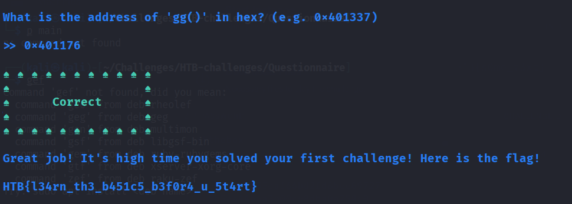

# Post Exploitation - Automation

To get more familiar with `pwntools` I decided to automate the process of solving this. Below is my solution:

```python
#!/usr/bin/env python3
from pwn import *

def processConnection():
    try:
        host,port = sys.argv[1].split(':')
        return remote(host,port)
    except IndexError:
        print("Usage: python3 exploit.py <host:port>")
        exit(1)

connection = processConnection()
# Part I - Binary Questions
connection.sendlineafter(b'>>',b'64-bit')
connection.sendlineafter(b'>>',b'dynamic')
connection.sendlineafter(b'>>',b'not stripped')
connection.sendlineafter(b'>>',b'NX')

#Part II - C Questions
connection.sendlineafter(b'>>',b'vuln()')
connection.sendlineafter(b'>>',b'0x20')
connection.sendlineafter(b'>>',b'gg()')

#Part III - Buffer Overflow Questions
connection.sendlineafter(b'>>',b'fgets()')
connection.sendlineafter(b'>>',b'40')
connection.sendlineafter(b'>>',b'0x401176')

#Output
connection.recv()
output = connection.recv()
#print(output)
flag = connection.recv().decode('utf-8')
print('Flag obtained:', flag)

```


Running this script produces the following:

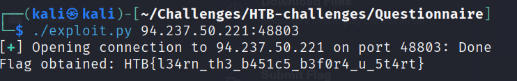

# Learning Outcomes

- Gained familiarity with `pwntools` and `ghidra`.
- Learned a bit more on the basics of binaries and c, as well as a common vulnerability (buffer overflow).

# Next steps

- Attempt to exploit buffer overflow vulnerabilities. This requires a deeper understanding of the C code.
- Learn how far a buffer overflow exploit can go.