# Introduction

I decided to enroll into the Binary Exploitation track from HackTheBox (found [here](https://app.hackthebox.com/tracks/Binary-Exploitation)) as it would give me a structured way to learn binary exploitation. I have already completed two of it's challenges, being racecar and questionnaire.

The next one is **Mathematricks**. which is another "Very Easy" rated pwn challenge. It is based on integer overflow and is fairly straightforward.

# Starting the Challenge

Within the given zip file, we find the following:

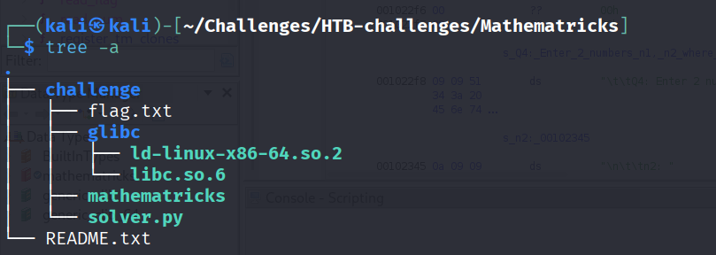

A `Challenge` directory, which contains a dummy flag file, `glibc` directory, a mathematics binary, and a `solver.py` which is a pre-written python script that should auto solve the challenge if given all the right answers.


# Enumeration

Using `file`:

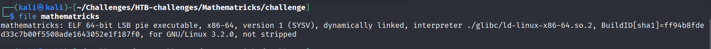

64-bit, dynamically linked binary.

Using `Checksec`:

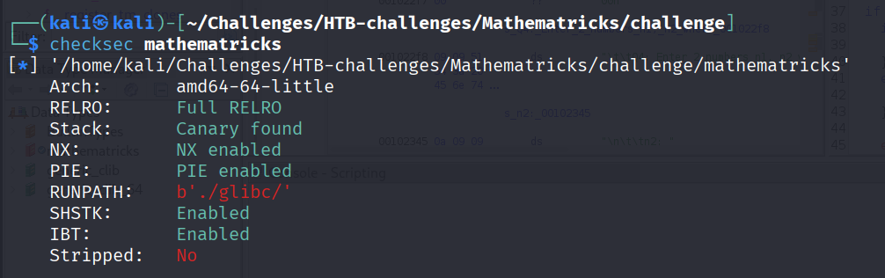

Almost everything is enabled, but it is not stripped.

# Exploitation

We start off by running the `mathematricks binary`, which displays the following screen:

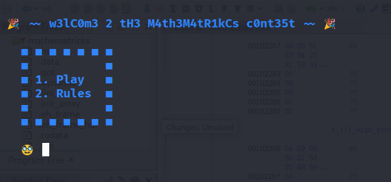

After sending 1 to Play, we start receiving some math questions, most of which are easy enough to solve.

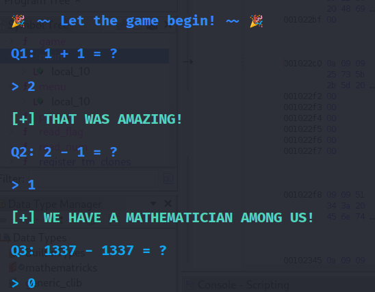

Then, the final question is the tricky one.

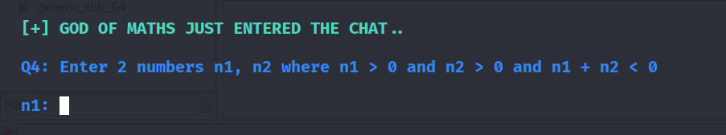

At face value, this question does not seem to make sense. how can two positive numbers add up to a negative number?

My first instinct is to check the source code using `Ghidra`. I found out that the two variables are stored as `long`, which in a 64-bit binary should store 64-bits of data.

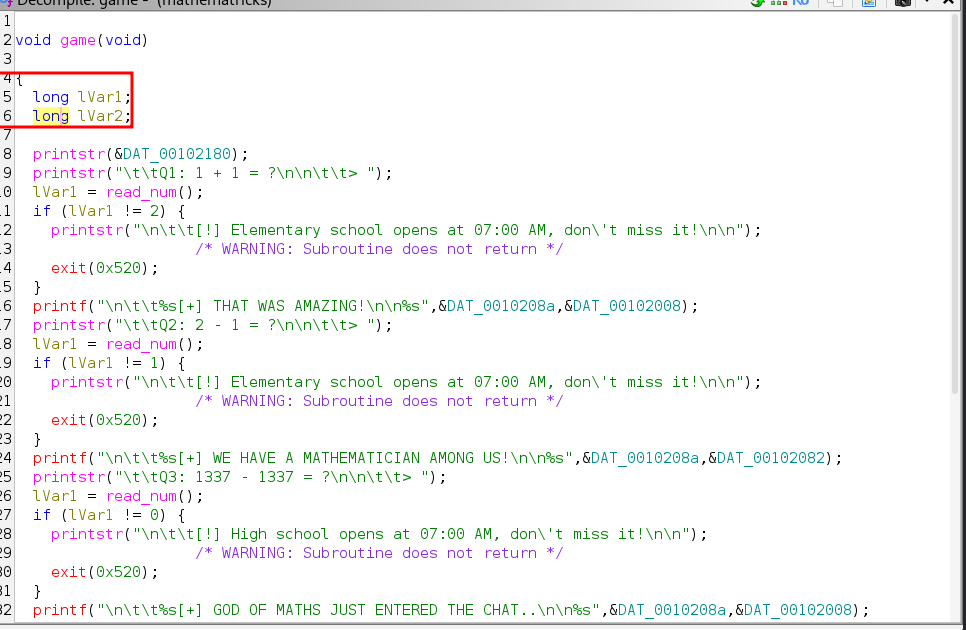

The code related to the final question can be seen below:

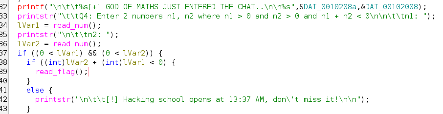

The first idea that came up to mind is to try to cause an integer overflow such that a positive number is being interpreted/read as a negative number.

The largest integer value that can be represented by `64` bits would be `2^63-1`, which is equal to `9223372036854775807` or `0x7FFFFFFFFFFFFFFF`. If we add 1 to this number, it should return `0x8000000000000000`. Since the first bit is `1`, this indicates a negative number, in fact the largest in a 64 bit number since we are using two's complement.

However, even though my deduction was okay, this answer was not correct.

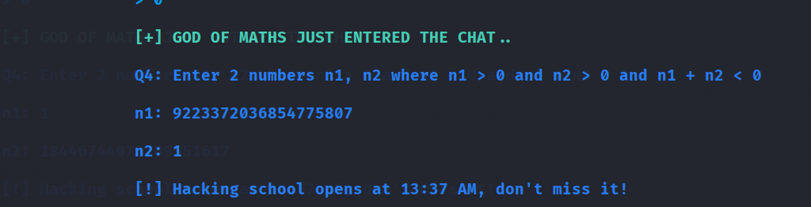

I will take a look at the writeup to check if I am on the right track.

After checking the writeup, the issue seems to be with the type of data that the variables are said to be.

The correct values were as follows

`1` and `2^31-1 (2147483647)`, this is due to the following line:

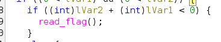

Since they are being converted to `int`, we need to cause an integer overflow on the size of the datatype `int`, not `long`.

By sending in the max value for `int` and then overflowing it, it is being treated as the max negative number now. This solves the question.


# Automation

Script was influenced by the `solver.py` provided in the way the flag is being captured.

Script:
```python
#!/usr/bin/env python3
from pwn import *

def processConnection():
    try:
        host,port = sys.argv[1].split(':')
        return remote(host,port)
    except IndexError:
        print("Usage: python3 exploit.py <host:port>")
        exit(1)

connection = processConnection()

connection.sendlineafter('🥸',b'1')
connection.sendlineafter(b'>',b'2')
connection.sendlineafter(b'>',b'1')
connection.sendlineafter(b'>',b'0')

connection.sendlineafter(b'n1:',b'1')
connection.sendlineafter(b'n2:',b'2147483647') #Largest positive int (32-bit signed)

flag = connection.recvline_contains('HTB').decode('utf-8')

print('Flag =',flag)
```


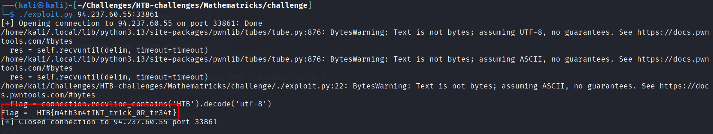

The flag is being captured properly, although we do get some warnings in the process.

# Learning Outcomes

- Learned about integer overflows vulnerabilities.
- Learned to be more attentive to the code, especially when operations are being done.

# Next Steps

- Solve integer overflow questions that require the overflow value to be more precise, and thus more difficult.