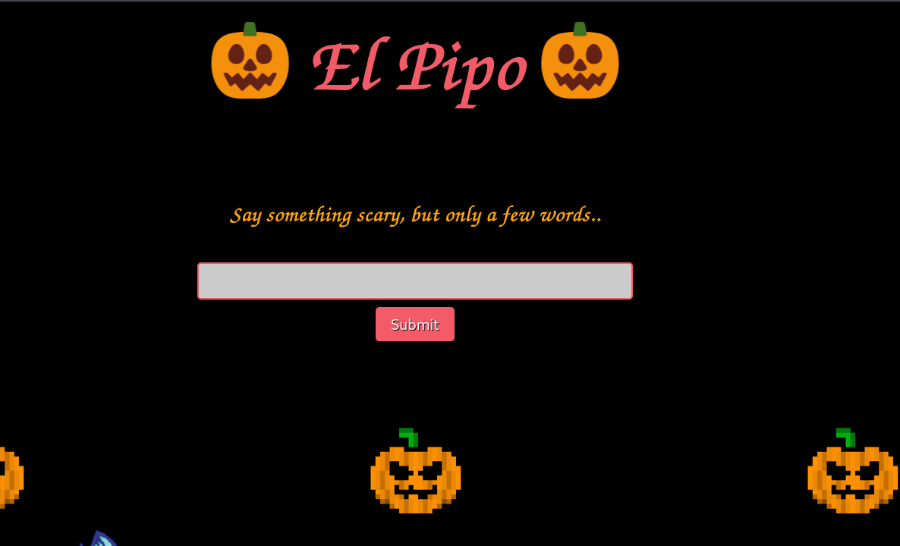
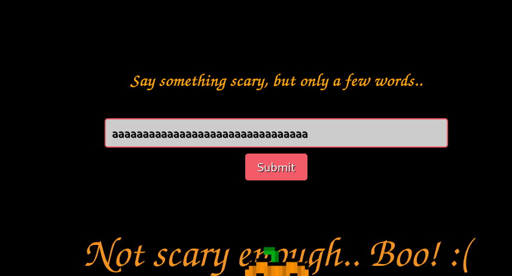
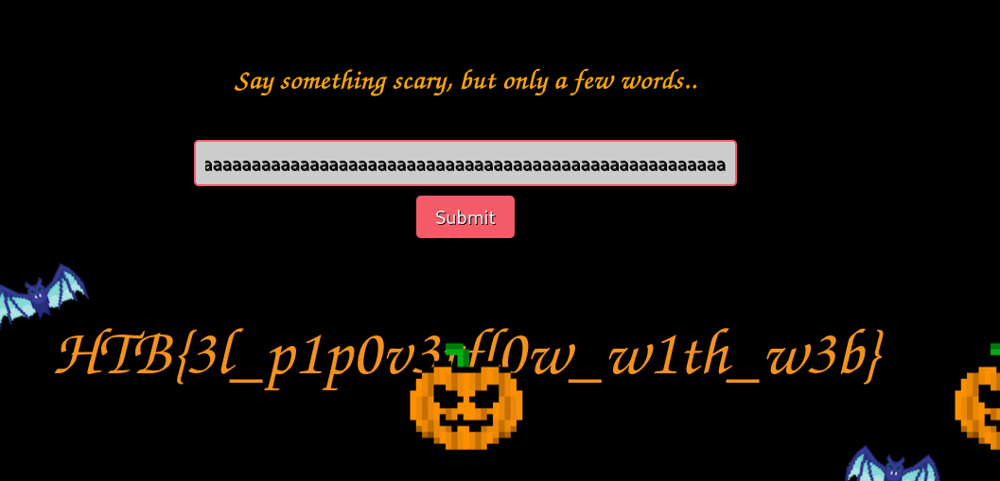
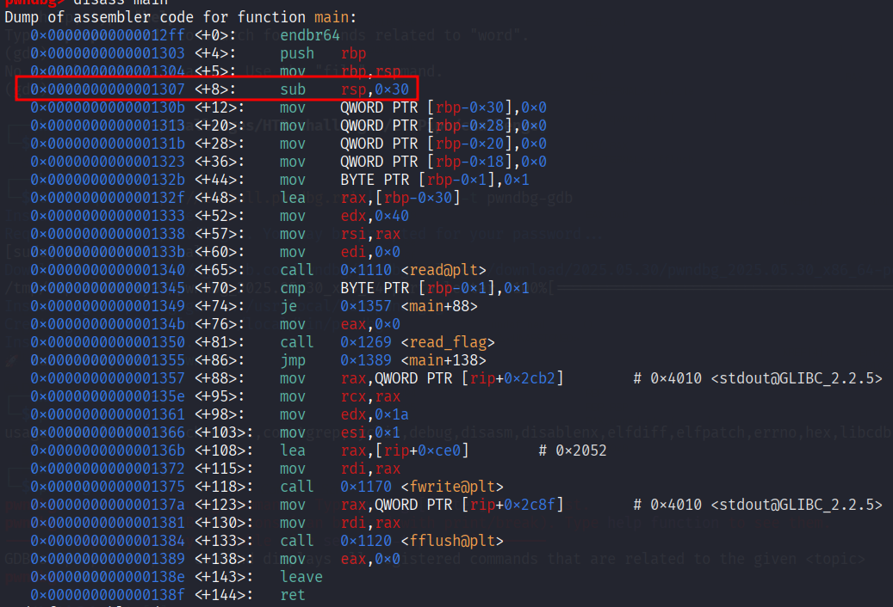
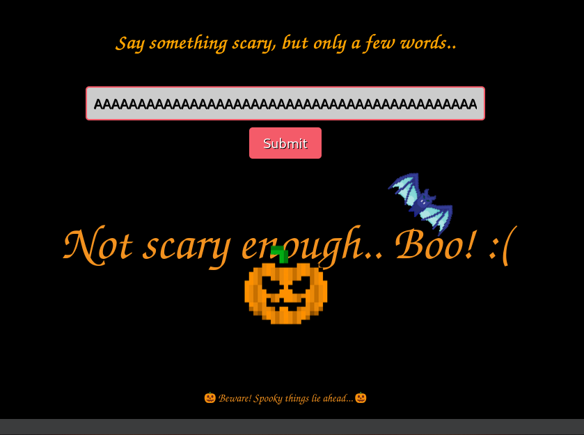
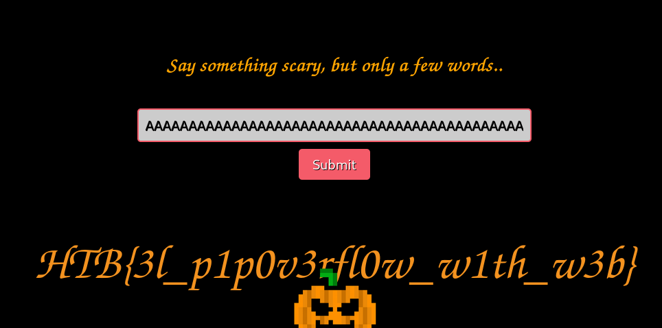

# Introduction

El pipo is another buffer overflow problem where the overflow is used to change a variable's value to bypass some condition.

# Enumeration

The zip file came with a README.txt that says the following:

>In this challenge, you'll be provided with the binary file that runs on the server's back end.
>
[\*] Your task is to reverse-engineer the binary and identify the vulnerability.
[!] Do not attempt to connect via netcat; a web page is provided for interaction :)
[\*] The input you submit is passed directly to the binary.
[!] If a few words don't get the job done, consider trying a bit more...

When visiting the webpage, we are met with the following:




Using ghidra to analyse the binary, we obtain the following main function:

```C

undefined8 main(void)

{
  undefined8 local_38;
  undefined8 local_30;
  undefined8 local_28;
  undefined8 local_20;
  char local_9;
  
  local_38 = 0;
  local_30 = 0;
  local_28 = 0;
  local_20 = 0;
  local_9 = '\x01';
  read(0,&local_38,0x40);
  if (local_9 == '\x01') {
    fwrite("Not scary enough.. Boo! :(",1,0x1a,stdout);
    fflush(stdout);
  }
  else {
    read_flag();
  }
  return 0;
}

```

from this code, we can deduce a couple of things.
1. to read the flag, we need the `if` condition to be false, so we need to find a way to change the value of `local_9`
2. In memory, we see that `local_38` is before `local_9`
3. the `read` function can read up to `0x40` bytes, or 64 in decimal, and places the data in the memory location of `local_38`.


# Exploitation

Through the webpage, we can input whatever number of characters that we would like.

so we can attempt to spam the letter 'a' and see what happens. 



Seems like we need to spam a bit more. If we add more, we get the following:



I have successfully obtained the flag, but I still am curious what is the exact number that was needed to cause this overwrite.

# Post Exploitation - Learning pwndbg

After looking up writeups, they all seem to be using a tool called pwndbg that eases the process of debugging binary files.

First, we start by running
```shell
pwndbg <filename>
```

this is followed by `disass <function-name>` to disassemble the function (main in this exmaple) to assembly.



This is the assembly code. We can see from this that `0x30` (or 48) bytes are being reserved for the variables. 

From our code, we know that 4 variables are 8 bytes long and `local_9` is 1. this makes a total of 33 bytes. Since stacks should be 16 bytes aligned, we should pad to the nearest, which would be 48. 

48-33 = 15 pad bytes. These pad bytes would be placed *Before* local_9's byte. This means that to overwrite local_9, we would need to write over the 4 variables of data (32 bytes) and the 15 padded bytes, which makes 47 pad bytes in total. Add in an extra 1 to overwrite local_9's data.

we can easily get 47 characters if we write the following in python:
```python
'A' * 47
```

Result of 47 characters:



If we add 1 more:



we successfully overwrite local_9 and get the flag.

# Post Exploitation - Automation

Will do later. Main hurdle here is to learn how to use pwntools when a webapp is involved.


# Learning outcomes

1. analyzed and understood how the memory is being utilized (at least on a basic level).
2. Understand when the buffer overflow exactly happens.

# Next steps

1. Learn automation/scripting when a webpage is involved.
2. try more sophisticated buffer overflow problems.